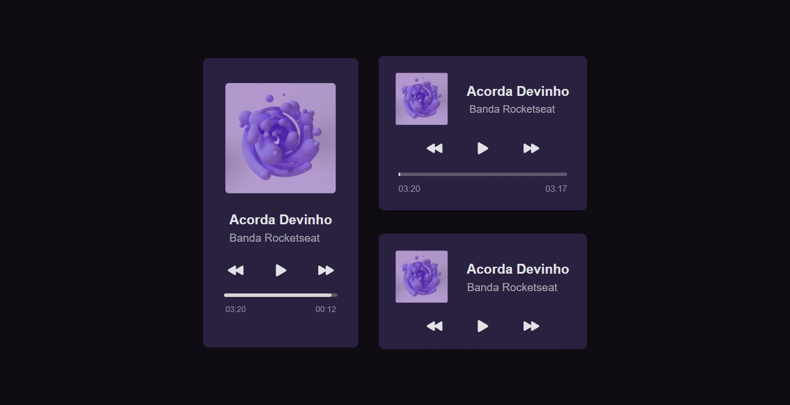
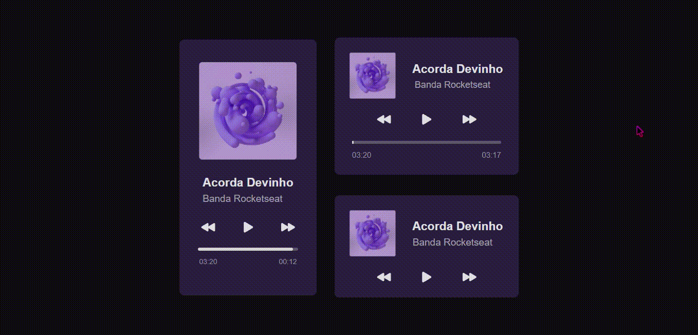

# #boraCodar-Rocketseat
Desafio do #boraCodar da <a href="">Rocketseat <a> concluído!<br>
 Foi usado como referência o layout do figma <a href="https://www.figma.com/file/n8Sjz4uACH6XKIhGR9Znm4/%23boraCodar---Desafio-1-(Copy)?node-id=1%3A61&t=PXQWhPZYfs1Br3oJ-0">link</a>
<br>

## Navegando pela aplicação

Antes de tudo, é necessário ter o NodeJS e o NPM instalado em seu computador. Basta instalar através desse <a href="https://nodejs.org/en/">link</a>.

---

Abra o terminal no diretório em questão e execute o seguinte comando:

```
npm install
```

Para rodar a aplicação em seu computador, utilize o comando:

```
npm start
```
## Página inicial
<figure width="100%" display="flex"
justify-content="center"  align="center">

</figure>

---
<figure width="100%" display="flex"
justify-content="center"  align="center">

</figure>

# :computer: Tecnologias

<div display:flex; flex-direction:row;>
 
  
    
       
    </div>